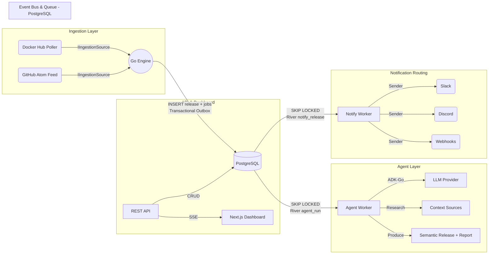
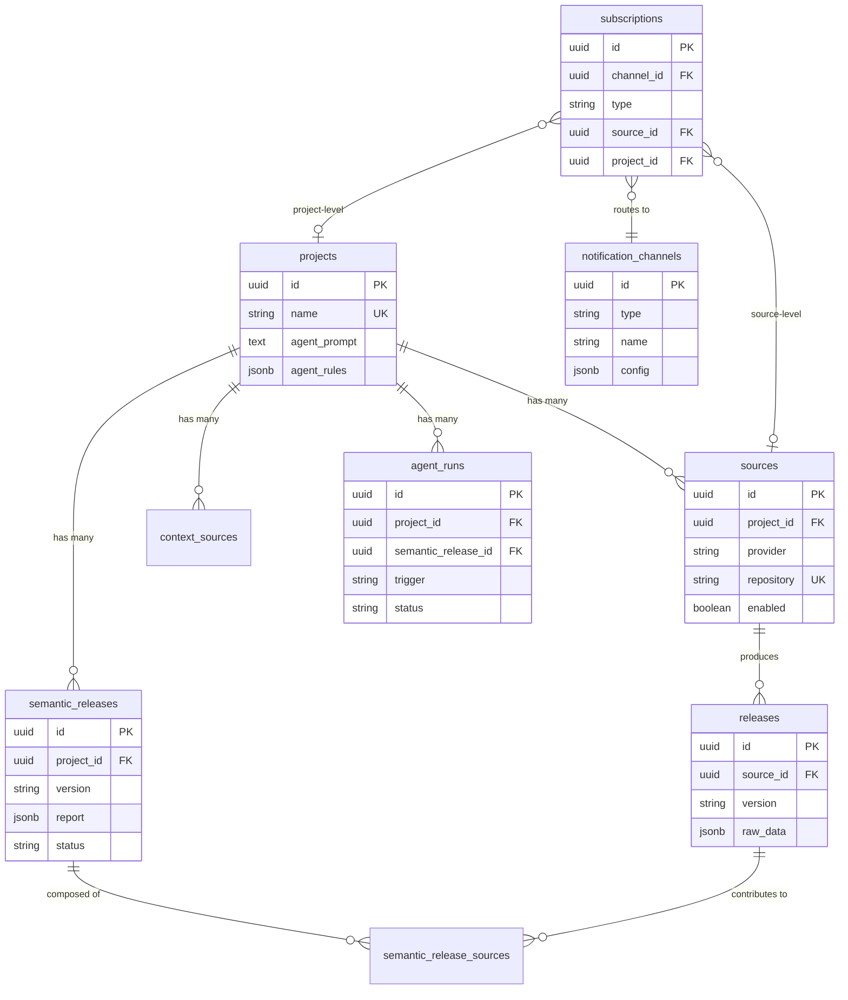

# Architecture: Changelogue

## Overview

Changelogue is an event-driven, hybrid-architecture system designed to centralize release discovery, automate validation, manage configurations, and distribute targeted notifications. It combines the high-concurrency performance of a Go-based polling engine with the reasoning capabilities of LLM-based SRE agents. By leveraging PostgreSQL for both persistent storage and message brokering, the system maintains high reliability and transactional consistency within a streamlined, single-binary deployment.

## 1. Tech Stack & Infrastructure

* **Backend / Engine:** Go (Golang). Chosen for its lightweight concurrency model (Goroutines) to handle simultaneous polling across multiple registries.
* **Frontend / Dashboard:** Next.js (React) with Tailwind CSS. Provides a fast, modern control center for viewing release streams and managing configurations.
* **Database, Queue, & Event Bus:** PostgreSQL.
* *Persistent Storage:* Standard relational tables for release metadata and system configurations.
* *Task Queue:* Utilizes `FOR UPDATE SKIP LOCKED` (via the **River** Go library) for robust, concurrent background job processing without race conditions.
* *Pub/Sub:* Utilizes native `LISTEN` and `NOTIFY` for real-time broadcasting to connected clients.


* **Intelligence Layer:** LLMs (Gemini / OpenAI-compatible) orchestrated via [ADK-Go](https://google.github.io/adk-go/) v0.5.0 for semantic changelog analysis and autonomous release evaluation.
* **Packaging:** Single binary deployment utilizing Go's `//go:embed` to serve the Next.js static export directly from the Go server.

## 2. System Design & Abstractions

The system is decoupled into four primary layers communicating entirely through PostgreSQL using the Transactional Outbox pattern:

1. **Ingestion Layer** — Polling workers and webhook handlers discover new releases from upstream registries.
2. **Notification Routing** — River workers send immediate notifications to source-level subscribers on new releases.
3. **Agent Layer** — ADK-Go agents research releases, consult context sources, and produce semantic release reports.
4. **Routing & Output** — Notification channels (Slack, Discord, webhooks) deliver alerts via `Sender`.

A **Project** is the central domain entity — it groups multiple ingestion sources, context sources, and notification subscriptions under a single tracked piece of software.



### Entity Relationship Model



### 2.1 The Event-Driven Backbone (PostgreSQL Only)

Components do not call each other synchronously. Instead, they rely on PostgreSQL to guarantee delivery:

* **The Transactional Outbox:** When a new release is detected, the ingestion worker writes the metadata to the `releases` table (linked to its `source_id`) and simultaneously enqueues River jobs (notification and/or agent) *within the exact same SQL transaction*. This guarantees no events are ever lost.
* **Real-time Pub/Sub:** Database triggers use `pg_notify` to broadcast lightweight events (e.g., telling the Next.js UI via SSE to refresh) over standard Postgres connections using `LISTEN`.
* **Reliable Queues:** River workers process jobs using `FOR UPDATE SKIP LOCKED`, ensuring exactly-once processing for both notification delivery and agent runs.
* **Project-Centric Model:** All data flows through the `projects` → `sources` → `releases` hierarchy. Subscriptions can attach at the source level (for raw release notifications) or the project level (for semantic release notifications).

### 2.2 Provider Interfaces (I/O)

All external integrations are abstracted behind strict Go interfaces.

* `IIngestionSource`: Standardizes how polling workers fetch data. Adding a new registry (like npm or NuGet) only requires implementing this interface. Each implementation maps to a `source_type` in the database.
* `Sender`: Standardizes output routing. Each implementation maps to a `type` in the `notification_channels` table (Slack, Discord, webhooks).

### 2.3 REST API & Dashboard

The Go server exposes a RESTful API (`/api/v1`) serving the Next.js dashboard and external consumers:

* **Resource CRUD:** Projects, sources, subscriptions, notification channels, context sources — all manageable through the API.
* **Read-Only Releases:** Releases and semantic releases are queryable but not directly writable via the API — they're created exclusively through the ingestion layer and agent runs.
* **Source Operations:** Manual poll trigger (`POST /sources/{id}/poll`) and channel test notifications (`POST /channels/{id}/test`).
* **SSE Real-Time Events:** `GET /api/v1/events` streams server-sent events backed by PostgreSQL `LISTEN/NOTIFY`, pushing release and semantic release updates to connected dashboard clients.
* **API Key Auth:** Bearer token authentication with hashed key storage. `NO_AUTH=true` disables auth for development.
* **Rate Limiting:** Per-key token bucket (10 rps, 20 burst) with standard `X-Ratelimit-*` response headers.
* **Stats & Trends:** Dashboard stats and time-bucketed release count trends via `/stats` and `/stats/trend`.

See [API.md](API.md) for the full endpoint reference.

### 2.4 Notification Routing

When a new source release is detected, a `notify_release` River job is enqueued in the same transaction as the release insert. The notification worker:

1. Resolves all source-level subscriptions for the release's source.
2. For each subscription, sends a notification to the linked channel via `Sender`.
3. Checks the project's agent rules — if the release matches (major bump, security patch, version pattern), enqueues an `agent_run` job automatically.

### 2.5 Agent Layer (Implemented)

For project-level intelligence, an `agent_run` River job triggers an LLM agent (via ADK-Go v0.5.0) that:

1. Gathers recent source releases for the project using the `get_releases` tool.
2. Inspects individual release details (changelogs, raw data) using `get_release_detail`.
3. Consults context sources (runbooks, docs, monitoring dashboards) using `list_context_sources`.
4. Produces a `SemanticRelease` with a structured `SemanticReport` (subject, risk level, changelog summary, status checks, download commands, urgency, recommendation).

Agent behavior is configured per-project via `agent_prompt` (custom instructions) and `agent_rules` (structured triggers like `on_major_release`, `on_security_patch`, `version_pattern`, `wait_for_all_sources`). Agent runs are tracked in the `agent_runs` table for observability and auditability.

**LLM Provider Support:**

The agent supports multiple LLM backends via the `LLM_PROVIDER` environment variable:
* **Gemini** (default) — Uses `GOOGLE_API_KEY` with ADK-Go's native Gemini model integration.
* **OpenAI** — Uses `OPENAI_API_KEY` and `OPENAI_BASE_URL` via an OpenAI-compatible adapter (`internal/agent/openai/`).

**Implementation details (`internal/agent/`):**

* **`tools.go`** — Three ADK function tools (`get_releases`, `get_release_detail`, `list_context_sources`) created via `functiontool.New()`. Tools are scoped to a project via `toolFactory` which holds the `AgentDataStore` and project ID.
* **`orchestrator.go`** — `Orchestrator` manages the full agent lifecycle: loading project config, creating an ADK `llmagent` with the configured LLM backend, running the agent via `runner.Runner`, parsing the JSON report, and persisting the `SemanticRelease` in a transaction.
* **`worker.go`** — `AgentWorker` implements `river.Worker[queue.AgentJobArgs]`, loading the agent run from the store and delegating to `Orchestrator.RunAgent()`.
* **Graceful degradation** — If no LLM API key is set, the orchestrator is not created, the worker is not registered, and a warning is logged. The rest of the system continues to function. Agent jobs remain in the River queue until the key is configured.

### 2.6 Agentic Tooling (Planned: SRE Validation)

For deep validation, Changelogue will utilize SRE agents with a suite of abstracted tools:

* `UpgradeBaseABoxConfig(version)`
* `CheckAgentStatus(environment)`
* `SyncOpsOpsack(payload)`
This will allow the agent to autonomously deploy a sandbox, verify that the deployment is healthy, and rollback or alert on failure.

## 3. Data Flow: Lifecycle of a Release Event

1. **Discovery:** A Go worker polling Docker Hub detects a new base image tag for a configured source (e.g., the "Docker Hub" source under the "Go Runtime" project). Source-level exclusion filters (`exclude_version_regexp`, `exclude_prereleases`) are applied — filtered versions are discarded immediately.
2. **Ingestion & Transaction:** The worker stores the raw upstream payload and executes a single database transaction to insert the record into `releases` (linked to its `source_id`) and enqueue a `notify_release` River job.
3. **Notification (Source-Level):** A River worker picks up the `notify_release` job, resolves source-level subscriptions, and sends alerts to configured notification channels (Slack, Discord, webhooks).
4. **Agent Rule Check:** The same notification worker evaluates the project's `agent_rules` against the new release version. If criteria match (major bump, security patch, version pattern), it enqueues an `agent_run` River job.
5. **Agent Analysis (Project-Level):** A River worker picks up the `agent_run` job. The ADK-Go agent gathers recent releases, consults context sources, and produces a `SemanticRelease` with a structured report (subject, risk level, changelog summary, status checks, urgency, recommendation).
6. **Broadcast:** PostgreSQL triggers fire `NOTIFY` payloads on release insert and semantic release completion, pushing SSE events to connected dashboard clients.
7. **Project-Level Notification:** When a semantic release is completed, project-level subscribers are notified with the AI-generated report.

## 4. Directory Structure

```text
/changelogue
├── cmd/
│   ├── server/          # Main Go application entry point
│   └── agent/           # Agent CLI — run agent analysis for a project
├── internal/
│   ├── api/             # REST API handlers, middleware, SSE broadcaster
│   ├── ingestion/       # Polling workers (IIngestionSource: Docker Hub, GitHub Atom)
│   ├── agent/           # ADK-Go agent for semantic release analysis
│   │   └── openai/      # OpenAI-compatible LLM provider adapter
│   ├── routing/         # Notification routing worker and channel implementations (Sender)
│   ├── queue/           # River queue job definitions (NotifyJobArgs, AgentJobArgs)
│   ├── db/              # Connection pool and schema migrations
│   └── models/          # Shared domain structs (Release, Project, SemanticRelease, etc.)
├── web/                 # Next.js frontend application
│   ├── app/             # App Router pages (dashboard, projects, releases, channels, etc.)
│   ├── components/      # React components organized by domain
│   └── lib/             # Client utilities and API wrappers
├── scripts/             # Integration test harness
├── docs/                # Design documents and plans
└── go.mod
```