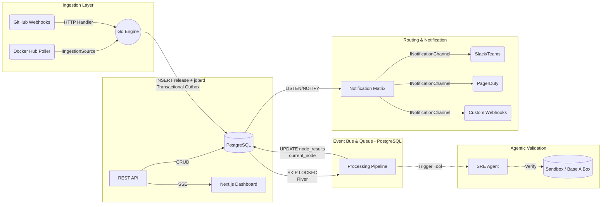
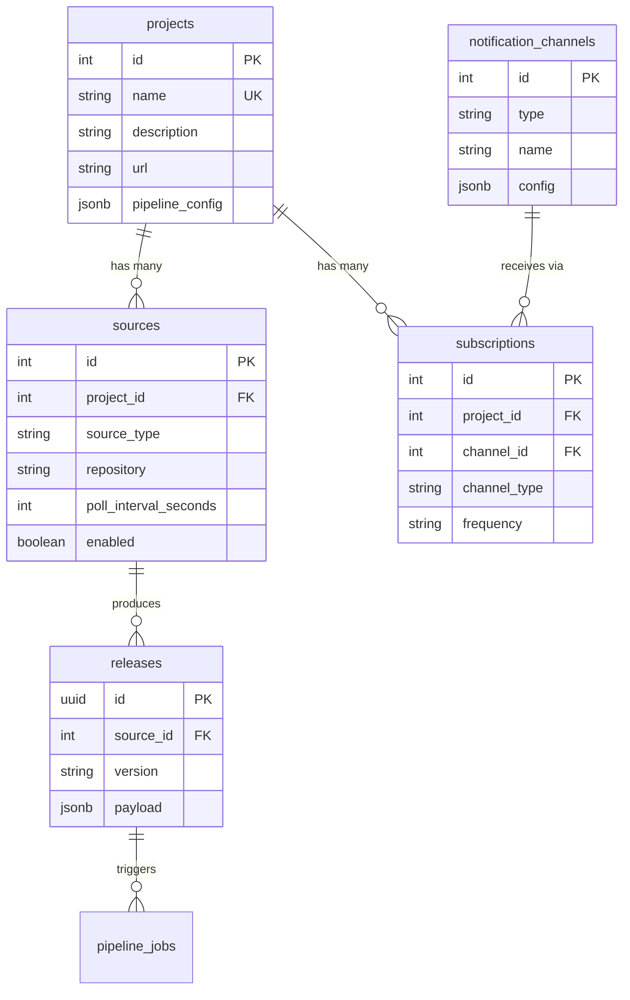

# Architecture: ReleaseGuard

## Overview

ReleaseGuard is an event-driven, hybrid-architecture system designed to centralize release discovery, automate validation, manage configurations, and distribute targeted notifications. It combines the high-concurrency performance of a Go-based polling engine with the reasoning capabilities of LLM-based SRE agents. By leveraging PostgreSQL for both persistent storage and message brokering, the system maintains high reliability and transactional consistency within a streamlined, single-binary deployment.

## 1. Tech Stack & Infrastructure

* **Backend / Engine:** Go (Golang). Chosen for its lightweight concurrency model (Goroutines) to handle simultaneous polling across multiple registries.
* **Frontend / Dashboard:** Next.js (React) with Tailwind CSS. Provides a fast, modern control center for viewing release streams and managing configurations.
* **Database, Queue, & Event Bus:** PostgreSQL.
* *Persistent Storage:* Standard relational tables for release metadata and system configurations.
* *Task Queue:* Utilizes `FOR UPDATE SKIP LOCKED` (via the **River** Go library) for robust, concurrent background job processing without race conditions.
* *Pub/Sub:* Utilizes native `LISTEN` and `NOTIFY` for real-time broadcasting to connected clients.


* **Intelligence Layer:** LLMs (Gemini / GPT-4o-mini) orchestrated via agent frameworks (e.g., LangGraph or Claude Agent SDK) for semantic changelog analysis and autonomous validation.
* **Packaging:** Single binary deployment utilizing Go's `//go:embed` to serve the Next.js static export directly from the Go server.

## 2. System Design & Abstractions

The system is decoupled into four primary layers communicating entirely through PostgreSQL using the Transactional Outbox pattern. A **Project** is the central domain entity — it groups multiple ingestion sources and notification subscriptions under a single tracked piece of software.



### Entity Relationship Model



### 2.1 The Event-Driven Backbone (PostgreSQL Only)

Components do not call each other synchronously. Instead, they rely on PostgreSQL to guarantee delivery:

* **The Transactional Outbox:** When a new release is detected, the ingestion worker writes the metadata to the `releases` table (linked to its `source_id`) and simultaneously inserts a processing job into the `pipeline_jobs` table *within the exact same SQL transaction*. This guarantees no events are ever lost.
* **Real-time Pub/Sub:** Database triggers use `pg_notify` to broadcast lightweight events (e.g., telling the Next.js UI via SSE to refresh) over standard Postgres connections using `LISTEN`.
* **Reliable Queues:** Go background workers poll the `pipeline_jobs` table using `FOR UPDATE SKIP LOCKED`, ensuring only one worker processes a specific release's pipeline at a time.
* **Project-Centric Model:** All data flows through the `projects` → `sources` → `releases` hierarchy. Subscriptions attach to projects, so notification rules automatically cover releases from any of a project's sources.

### 2.2 Provider Interfaces (I/O)

All external integrations are abstracted behind strict Go interfaces.

* `IIngestionSource`: Standardizes how polling workers fetch data. Adding a new registry (like npm or NuGet) only requires implementing this interface. Each implementation maps to a `source_type` in the database.
* `INotificationChannel`: Standardizes output routing. Each implementation maps to a `type` in the `notification_channels` table (Slack, PagerDuty, custom webhooks).

### 2.3 REST API & Dashboard

The Go server exposes a RESTful API (`/api/v1`) serving the Next.js dashboard and external consumers:

* **Resource CRUD:** Projects, sources, subscriptions, notification channels — all manageable through the API.
* **Read-Only Releases:** Releases and pipeline status are queryable but not writable via the API — they're created exclusively through the ingestion layer.
* **SSE Real-Time Events:** `GET /api/v1/events` streams server-sent events backed by PostgreSQL `LISTEN/NOTIFY`, pushing release and pipeline updates to connected dashboard clients.
* **API Key Auth:** Bearer token authentication with hashed key storage. Webhooks use their own HMAC-based auth.
* **Rate Limiting:** Per-key token bucket with standard `X-Ratelimit-*` response headers.

### 2.4 The Configurable Processing Pipeline

The core filtering and scoring logic is structured as a **configurable sequential pipeline**. Instead of monolithic conditional blocks, the system compiles a pipeline of independent execution nodes. **Which nodes run and how they behave is controlled per-project** via `pipeline_config` — an opaque JSONB map where each key is a node name and its value is that node's configuration. Nodes execute sequentially; independent nodes (e.g., Availability Checker, Risk Assessor) could be parallelized in a future iteration without changing the node interface.

**Always-on nodes** (structural — cannot be disabled):

1. **Regex Normalizer** — Parses version, applies source-level exclusion filters.
2. **Subscription Router** — Checks project subscriptions, drops unsubscribed events.

**Configurable nodes** (opt-in per project, each with its own config schema):

3. **Availability Checker** — Source-linked checks are automatic (Docker → verify image, GitHub → verify binaries). Config adds extra artifacts.
4. **Risk Assessor** — Changelog keyword scanning is automatic. Config adds external signals (Discord, Telegram, GitHub Advisories).
5. **Adoption Tracker** — Always requires config (provider + metrics source).
6. **Changelog Summarizer** — Uses release changelog. Config can override LLM strategy.
7. **Urgency Scorer** — Composite urgency from all preceding results. Config adjusts thresholds.
8. **Validation Trigger** — Triggers SRE agent. Config sets urgency threshold.

Every node implements a common `PipelineNode` interface and receives its config as raw JSON, which it unmarshals into its own typed struct. This means adding a new node or evolving a node's config requires no changes to the pipeline runner or database schema — just register the node and update the project's `pipeline_config`. The interface is designed to support **external plugin nodes** in the future — user-authored processing logic loaded via a plugin registry and executed over a transport layer (e.g., gRPC sidecar), with no changes to the runner or schema.

The final notification is assembled as a fixed template with dynamic sections — each enabled configurable node maps to a section, and disabled nodes produce no section.

### 2.5 Agentic Tooling

For deep validation, ReleaseGuard utilizes SRE agents. The agent is provided a suite of abstracted tools:

* `UpgradeBaseABoxConfig(version)`
* `CheckAgentStatus(environment)`
* `SyncOpsOpsack(payload)`
This allows the agent to autonomously deploy a sandbox, verify that the deployment is healthy, and rollback or alert on failure.

## 3. Data Flow: Lifecycle of a Release Event

1. **Discovery:** A Go worker polling Docker Hub detects a new base image tag for a configured source (e.g., the "Docker Hub" source under the "Go Runtime" project). Source-level exclusion filters (`exclude_version_regexp`, `exclude_prereleases`) are applied — filtered versions are discarded immediately.
2. **Ingestion & Transaction:** The worker standardizes the payload into a `ReleaseEvent` IR and executes a single database transaction to insert the record into `releases` (linked to its `source_id`) and queue a job in `pipeline_jobs`.
3. **Processing (Queue Pull):** A Go worker pulls the job using `SKIP LOCKED` and routes the event through the processing pipeline. Each node updates `current_node` and accumulates results in `node_results`. The subscription router checks the parent project's subscriptions — unsubscribed events are marked as `skipped`.
4. **Analysis & Validation:** For stable releases, the LLM analyzes the release notes to generate a "Production Record" summary. If the urgency score meets a threshold, an SRE agent is triggered to draft a master config update for Base A Box and run automated health checks.
5. **Finalization & Broadcast:** The worker updates the job status to `completed` in PostgreSQL. A Postgres trigger fires a `NOTIFY` payload to alert the routing matrix and push SSE events to connected dashboard clients.
6. **Notification:** The Notification Matrix reads the finalized data, resolves the project's subscriptions, and routes to the appropriate notification channels (e.g., a critical PagerDuty alert for hotfixes via instant delivery, or a batched daily digest to Slack for low-priority updates).

## 4. Directory Structure

```text
/releaseguard
├── cmd/
│   └── server/          # Main Go application entry point
├── internal/
│   ├── api/             # REST API handlers, middleware, SSE broadcaster
│   ├── ingestion/       # Polling workers and webhook handlers (IIngestionSource)
│   ├── pipeline/        # Pipeline node implementations for filtering & scoring
│   ├── agents/          # LLM orchestration and validation tools
│   ├── routing/         # Notification matrix and I/O providers (INotificationChannel)
│   ├── queue/           # PostgreSQL River queue setup and job definitions
│   ├── db/              # Connection pool and schema migrations
│   └── models/          # Shared domain structs (ReleaseEvent, Project, etc.)
├── web/                 # Next.js frontend application
│   ├── app/
│   └── components/
├── deployments/         # Dockerfiles and Base A Box integration scripts
└── go.mod

```