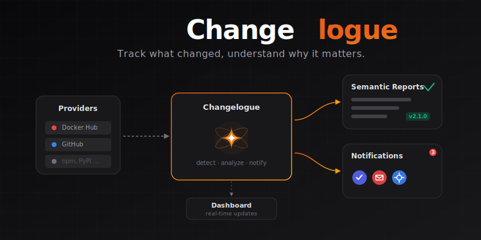
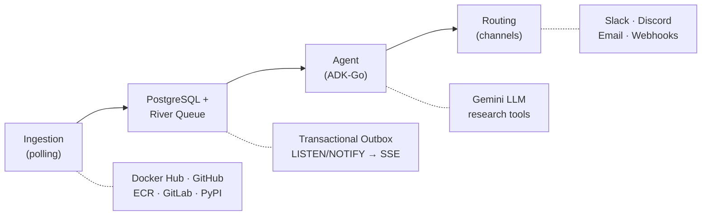

<p align="center">
  
</p>


## What it does

- **Discovers releases** by polling Docker Hub, GitHub, ECR Public, GitLab, and PyPI on configurable intervals
- **Routes notifications** to Slack, Discord, email, and webhooks the moment a new version lands
- **Generates AI reports** via Google Gemini agents that research changelogs, assess risk, and summarize what changed
- **Serves a dashboard** (Next.js) for managing projects, sources, subscriptions, and browsing releases in real time

## Architecture



Release insert and job enqueue happen in a single SQL transaction — zero-loss guarantee.

See [ARCH.md](ARCH.md), [API.md](API.md), and [DESIGN.md](DESIGN.md) for the full design.

## Quick start

**Prerequisites:** Go 1.25+, Docker, Node.js 20+

```bash
# Start Postgres and the server (NO_AUTH mode)
make dev

# In another terminal — start the frontend
make frontend-install
make frontend-dev
```

The API runs on `localhost:8080`, the dashboard on `localhost:3000`.

## CLI

The `clog` CLI manages Changelogue resources from the command line.

### Install

```bash
make cli    # builds ./clog binary
```

### Configuration

```bash
export CHANGELOGUE_SERVER=http://localhost:8080    # server URL
export CHANGELOGUE_API_KEY=rg_live_abc123...       # API key
```

Or pass per-command:

```bash
clog --server http://myserver:8080 --api-key rg_live_... projects list
```

### Commands

```
clog projects list|get|create|update|delete      Manage projects
clog sources list|get|create|update|delete        Manage ingestion sources
clog releases list|get                            Browse releases
clog channels list|get|create|update|delete|test  Manage notification channels
clog subscriptions list|get|create|update|delete  Manage subscriptions
clog subscriptions batch-create|batch-delete      Batch operations
clog version                                      Print CLI version
```

Use `--json` on any command for machine-readable output. Use `--help` on any command for detailed usage and examples.

## Environment variables

| Variable | Default | Purpose |
|----------|---------|---------|
| `DATABASE_URL` | `postgres://localhost:5432/changelogue?sslmode=disable` | PostgreSQL connection |
| `LISTEN_ADDR` | `:8080` | HTTP server bind address |
| `NO_AUTH` | _(unset)_ | Set to `true` to disable API key auth (development) |
| `LOG_LEVEL` | `info` | Log level: `debug`, `info`, `warn`, `error` |
| `LLM_PROVIDER` | `gemini` | LLM provider: `gemini` or `openai` |
| `LLM_MODEL` | `gemini-2.5-flash` / `gpt-5.2` | Model name (default depends on provider) |
| `GOOGLE_API_KEY` | _(empty)_ | Gemini API key (required when `LLM_PROVIDER=gemini`) |
| `OPENAI_API_KEY` | _(empty)_ | OpenAI API key (required when `LLM_PROVIDER=openai`) |
| `OPENAI_BASE_URL` | `https://api.openai.com/v1` | OpenAI-compatible API base URL |
| `GITHUB_CLIENT_ID` | _(required in prod)_ | GitHub OAuth App client ID |
| `GITHUB_CLIENT_SECRET` | _(required in prod)_ | GitHub OAuth App client secret |
| `ALLOWED_GITHUB_USERS` | _(empty)_ | Comma-separated GitHub usernames allowed to log in |
| `ALLOWED_GITHUB_ORGS` | _(empty)_ | Comma-separated GitHub org logins allowed to log in |
| `SESSION_SECRET` | _(required in prod)_ | Secret key for HMAC-signing session cookies |
| `SECURE_COOKIES` | `true` | Set `false` for local HTTP dev |

At least one of `ALLOWED_GITHUB_USERS` or `ALLOWED_GITHUB_ORGS` must be set when `NO_AUTH` is not `true`.

## Project structure

```
cmd/
  server/              Entry point — wires all layers together
  cli/                 CLI binary (clog) — REST API client
  agent/               Agent CLI — run agent analysis for a project
internal/
  agent/               ADK-Go agent orchestrator, tools, and worker
    openai/            OpenAI-compatible LLM provider
  api/                 REST API, SSE, middleware, auth
  db/                  Connection pool and migrations
  ingestion/           Polling sources (Docker Hub, GitHub, ECR Public, GitLab, PyPI)
  models/              Shared domain types
  queue/               River job definitions and client
  routing/             Notification channels and delivery worker
web/                   Next.js dashboard (React + Tailwind + shadcn)
scripts/               Integration test harness
```

## Extending

More providers (npm, Helm, etc.) and channels (PagerDuty, etc.) are planned. Adding one is a single-interface implementation:

**Add a registry provider** — implement `IIngestionSource` in `internal/ingestion/source.go`:

```go
type IIngestionSource interface {
    FetchNewReleases(ctx context.Context) ([]IngestionResult, error)
}
```

**Add a notification channel** — implement `Sender` in `internal/routing/sender.go`:

```go
type Sender interface {
    Send(ctx context.Context, channel models.NotificationChannel, msg Message) error
}
```

## Releasing

Releases are automated via [GoReleaser](https://goreleaser.com/) and GitHub Actions.

Pushing a `v*` tag triggers the [release workflow](.github/workflows/release.yml), which cross-compiles the server and CLI for linux/darwin (amd64/arm64), creates archives with checksums, and publishes a GitHub Release.

```bash
# Tag and push — triggers the full pipeline
make release VERSION=v0.2.0

# Local dry run (requires goreleaser installed)
make release-dry-run
```

See [CHANGELOG.md](CHANGELOG.md) for the release history.

## Useful commands

```bash
make build              # go build -o changelogue ./cmd/server
make cli                # build clog CLI binary
make test               # go test ./...
make coverage           # go test with coverage profile + print total %
make vet                # go vet ./...
make lint               # alias for vet
make integration-test   # full integration test (spins up its own Postgres)
make db-reset           # drop and recreate the local database
make frontend-build     # build Next.js static export
make agent-dev          # run agent CLI for a specific project
make release VERSION=x  # tag and push a release
make release-dry-run    # test GoReleaser locally without publishing
make clean              # remove binary, stop containers, delete volumes
```
